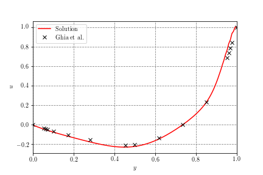
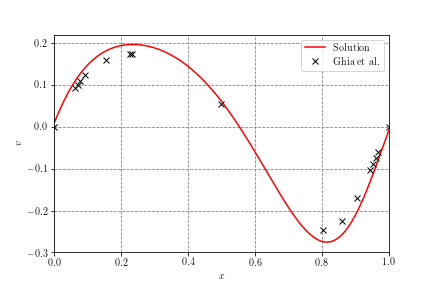
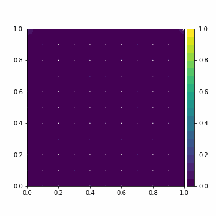
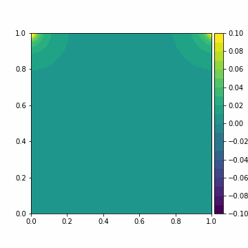
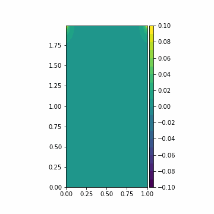
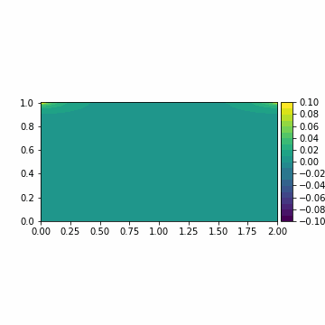

Done as an assignment for university, the aim of this project is to implement a numeric solver for the Navier-Stokes equation for incompresible fluid flow using the method of finite differences. It is based on material handed out by the university which in return is mainly based on Griebel et al., 1998: *Numerical Simulation in Fluid Dynamics*. We implement the lid-driven cavity problem as a benchmark for our code and compare the results to those presented by Ghia et al., 1982: *High-Re solutions for incompressible flow using the Navier-Stokes equations and a multigrid method*. Lastly, we also experimented with rectangular box shapes and periodically oscillating boundary conditions.

 

# Building

The included makefile should work with gcc out of the box. Simply type `make` to start the build. For other compilers you need to compile by yourself.

# Parameters and Running

`parameters.txt` stores all necessary information to run a simulation. The file is comented so any adjustments you'd want to make should be self-explanatory. A simulation can be run by executing `main`, just type `./main`. Plots can be created via the included `.py` scripts. The scripts might need to be tweaked depending on your simulation parameters but are also commented. Make sure to create the directories `obj` and `out` by yourself before building or running, respectively.

For more detailed descriptions of the code take a look at the [docs](https://captainproton42.github.io/NavierStokes/).

# Results

Below the results we obtained for different parameters as animations.

## Lid-Driven Cacvity

### Re = 10

### Re = 100

### Re = 1000

### Re = 10000

## Different Resolutions

### 65x65

### 257x257

## Rectangular Geometries

### Portrait

### Landscape

## Periodic Boundary Conditions

### Re = 100

### Re = 10000

